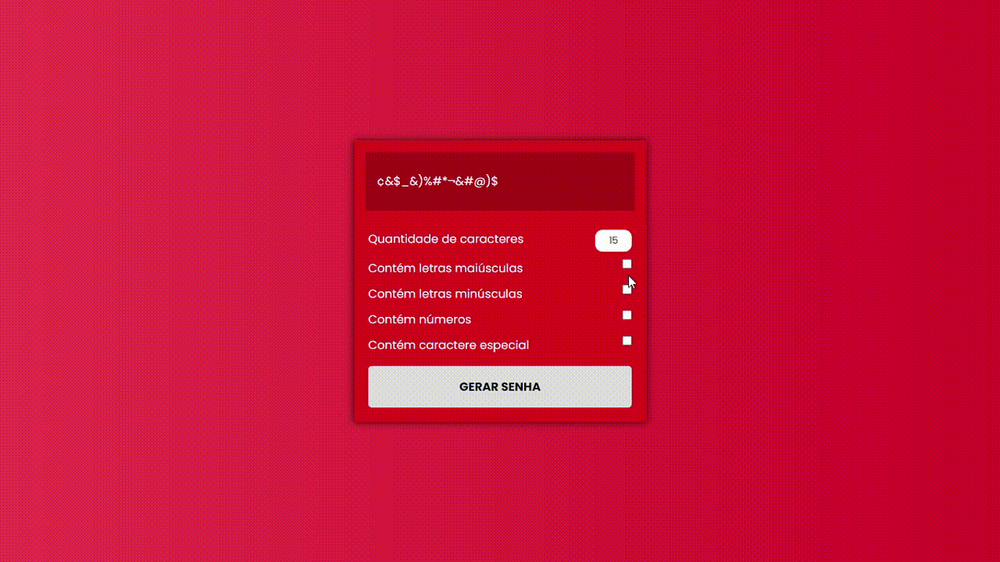

<h1 align="center"> :computer: Projetos Diversos :computer: </h1>

<p align="center">

</p>

<p align="center">Olá! Seja bem-vindo ao meu repositório de projetos diversos. Aqui você irá encontrar alguns dos diversos projetos que desenvolvo nas horas vagas.</p>
<p align="center">Este repositório será atualizado conforme novos projetos vão sendo desenvolvidos.</p>

<h2 align="center"> :computer: Tecnologias Utilizadas :computer:</h2>

<p align="center">
  
  
  
</p>

<h2 align="center">:rocket: Projetos Desenvolvidos :rocket:</h2>

<details>
  <summary>Feathered Friends</summary>
  <p>Um projeto de uma linda galeria de aves, a galeria conta com opção de filtrar por nomes.</p>
  <p align="center"></p>
  <p align="center"><a href="https://github.com/matheusz98/projetos/tree/master/Projeto%20Feathered%20Friends">Link do projeto</a></p>
</details>

<details>
  <summary>Contagem Regressiva</summary>
  <p>Uma simples aplicação de contagem regressiva até o natal. Projeto desenvolvido em JavaScript.</p>
  <p align="center"></p>
  <p align="center"><a href="https://github.com/matheusz98/projetos/tree/master/Projeto%20Contagem%20Regressiva">Link do projeto</a></p>
</details>

<details>
  <summary>Anotações</summary>
  <p>Uma aplicação feita em JavaScript na qual é possível criar anotações, editar, salvar ou apagar elas. O histórico das anotações ficam salvos no seu navegador.</p>
  <p align="center"></p>
  <p align="center"><a href="https://github.com/matheusz98/projetos/tree/master/Projeto%20Anotações">Link do projeto</a></p>
</details>

<details>
  <summary>Lista de Tarefas</summary>
  <p>Uma aplicação de lista de tarefas desenvolvida em JavaScript. Nesta aplicação é possível inserir novas tarefas a serem cumpridas, marcar como concluída ou apagar. As tarefas irão ficar armazenadas no local storage do seu navegador.</p>
  <p align="center"></p>
  <p align="center"><a href="https://github.com/matheusz98/projetos/tree/master/Projeto%20Lista%20de%20Tarefas">Link do projeto</a></p>
</details>

<details>
  <summary>Gerador de Senhas</summary>
  <p>Uma aplicação JavaScript capaz de gerar senhas. Caso o usuário desejar, a senha pode conter letras maiúsculas ou minúsculas, números e caracteres especiais. O tamanho da senha varia de acordo com a preferência do usuário.</p>
  <p align="center"></p>
  <p align="center"><a href="https://github.com/matheusz98/projetos/tree/master/Projeto%20Gerador%20de%20Senhas">Link do projeto</a></p>
</details>

<h4 align="center"> :construction: Este repositório está em construção, com o tempo ele será atualizado com novos projetos. :construction:</h4>

<h2 align="center">Curtiu o repositório? Fique a vontade para fazer uso dele! :grin:</h2>

```bash
# Clonar o repositório
$ git clone https://github.com/matheusz98/projetos

# Ou
# Ir no code (botãozinho verde) e fazer download do zip.
```

<h2 align="center">Muito obrigado pela visita! :smile: :grinning: </h2>
